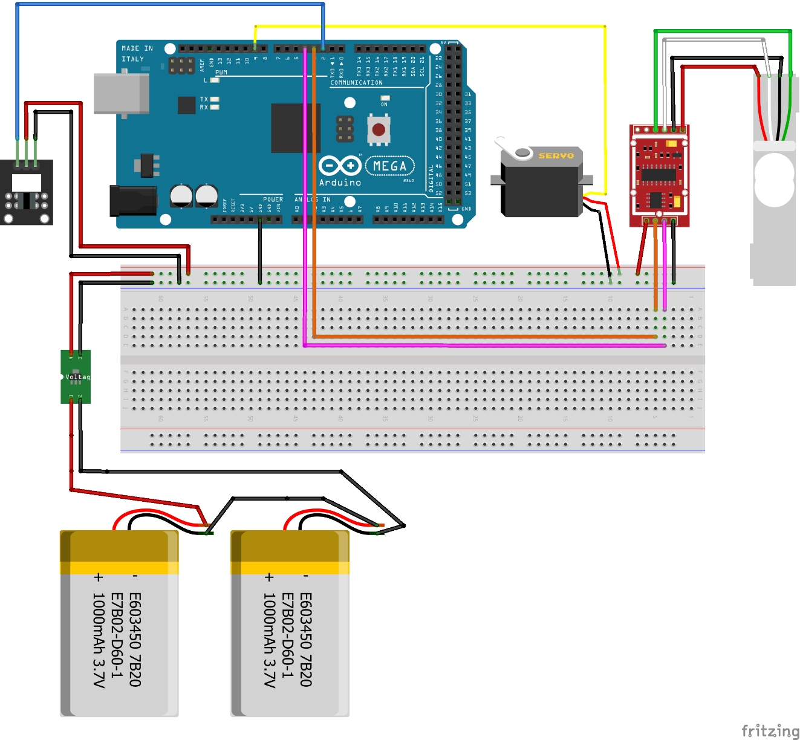
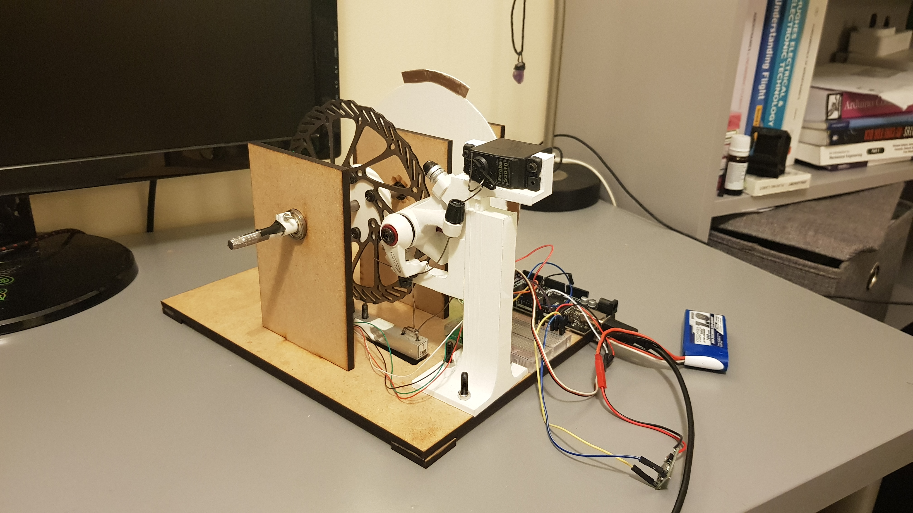

# mini-dynamometer
A program to run and test my mini dynamometer project for my final year dissertation

## Project Introduction and Aim

The principal aim of this project is to design, build and test a mini dynamometer to measure the rotational power output of small-scale devices, such as small electric motors or experimental prototypes etc.

This github repository will be mainly used to display the code written to test and calibrate the prototype rig, I will also upload some photos of the first rig prototype and a circuit diagram of the electronics used. 

I will not include the whole written report as the ownership of my dissertation is shared with Coventry University, however I will be happy to answer any questions about the project as I found it thoroughly enjoyable and would have loved to carry it on and improve on it.

## Testing Code

## Circuit Diagram

## Prototype Rig Photos

